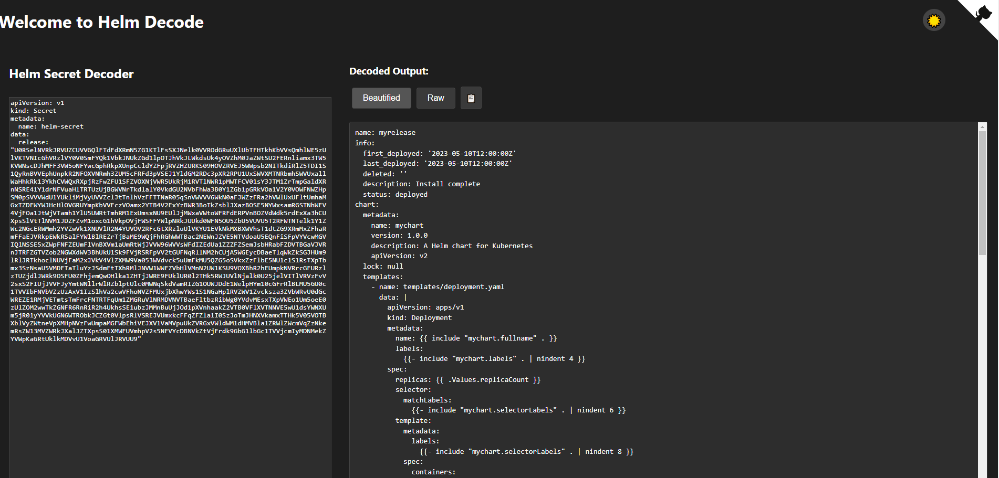

# helm-decode
A static, offline website that able to decode Helm3 resources in secrets

## Live Demo
You can access the live version of this tool at: [https://helm-decode.tmp.me/](https://helm-decode.tmp.me/)

## Description
This tool allows you to decode Helm3 resources stored in Kubernetes secrets. It's a static website that runs entirely in the browser, ensuring that your sensitive data never leaves your local machine.

## Features
- Decode Helm3 secrets
- Live decoding as you type
- Supports both YAML and JSON input formats
- Fully client-side processing for enhanced security

## Usage
1. Visit the [Helm Decode Tool](https://helm-decode.tmp.me/)
2. Paste your Helm secret into the input area
3. The decoded output will appear automatically on the right side

## Local Development
To run this project locally:

1. Clone the repository
2. Install dependencies with `npm install`
3. Start the development server with `npm start`
4. Open [http://localhost:3000](http://localhost:3000) in your browser

## Contributing
Contributions are welcome! Please feel free to submit a Pull Request.

## License
This project is licensed under the MIT License - see the [LICENSE](LICENSE) file for details.
